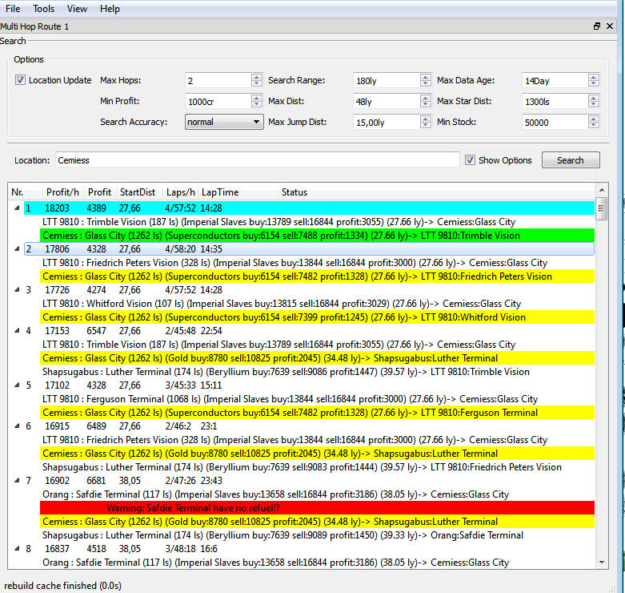
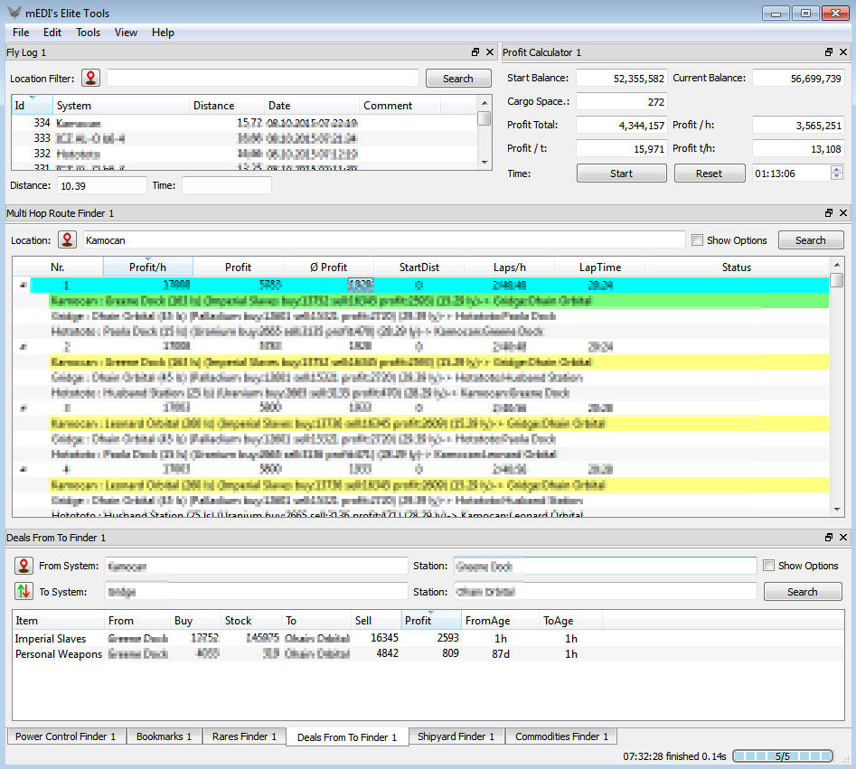

# mEDI's Elite Tools

Tools for Elite:Dangerous
========
**This app is under Heavy developend and not finished!**

## Features: ##
* Live data update and import from many sources
* Clippord Helper (push next navi point to clipbord) `start over route contextmenü`

## Screenshot's ##

multi hop route

multiple open tools

## Data Sources ##
* [Elite: Dangerous Market Connector (EDMC) `csv files`](https://github.com/Marginal/EDMarketConnector)
* [eddb - Elite: Dangerous Database](http://eddb.io)
* [Maddavo's Market Share](http://www.davek.com.au/td/)
* [Slopey's BPC Market Tool `local installation`](https://forums.frontier.co.uk/showthread.php?t=76081)

## Usage ##
1. Select in Tools menü ur wanted tool
2. Set Options and play with this
3. Search ;)
4. Right Mousebutton `contextmenü` have on some points usefull options

## Download ##

Windows alpa build [Download](http://tmp.medi.li/mediselitetools.7z)

linux users get the sources and start it in console `python main.py`
requiered modules: PySide

----------

# Required #

### VerboseLogging
to get the current location
enabel VerboseLogging

Open in a texteditor  like [notepad++](https://notepad-plus-plus.org/)

`c:\Program Files (x86)\Steam\SteamApps\common\Elite Dangerous\Products\FORC-FDEV-D-1010\AppConfig.xml`

search Network and set it to

        <Network
          VerboseLogging="1"
          Port="0"
          upnpenabled="1"
          LogFile="netLog"
          DatestampLog="1"
         >
       </Network>
and restart the game
